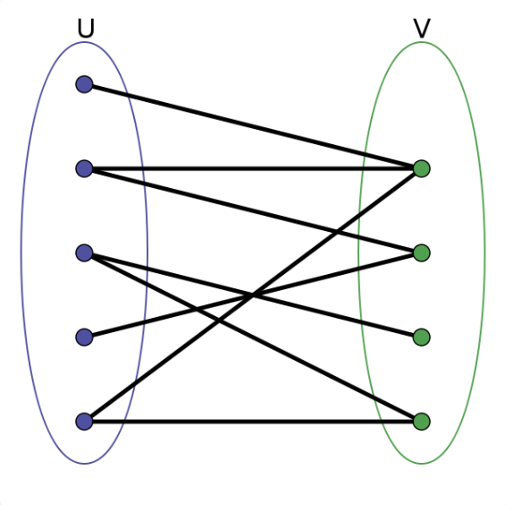

# 图相关的笔记

## 1.基础

- **逻辑结构：** 类似于树的结构，每个结点储存自身值和相邻的边；
- **图的存储：** 邻接表、邻接矩阵。
    -   邻接表：将某节点的邻居存到一个列表里，然后把该节点与这个列表关联起来；
        - 优点：储存空间小；
        - 缺点：不能快速判断两个点是否相邻。 
    - 邻接矩阵： 一个二维数组，位置（x，y）储存结点x与结点y的边的关系。
        - 优点：能快速判断两个点是否相邻；
        - 缺点：储存空间大。
    
- **图的遍历**： 本质就是多叉树的遍历，需要加visited结点防止重复遍历

> 两种多叉树的遍历：

~~~ java
void traverse(TreeNode root) {
    if (root == null) return;
    System.out.println("enter: " + root.val);
    for (TreeNode child : root.children) {
        traverse(child);
    }
    System.out.println("leave: " + root.val);
}

void traverse(TreeNode root) {
    if (root == null) return;
    for (TreeNode child : root.children) {
        System.out.println("enter: " + child.val);
        traverse(child);
        System.out.println("leave: " + child.val);
    }
}
~~~

两种的区别是：第一种能遍历到根节点，第二种不能遍历到根节点；
回溯算法一般使用第二种，因为只关心树枝而不是根。

## 2.拓扑排序详解及运用
### 1). 环检测算法
首先把给出的图有邻接表或者邻接矩阵重构出来。

- **DFS:**
    -   Solution_207的DFS算法。
    - 先重构graph，然后用visited和onpath的布尔值数组，
    分别记录是否遍历过和当前DFS遍历的路径。
    - 进入某结点的时候，onpath和visited的当前结点为true。
    出结点时设onpath为false，即回溯法。
    - 进入节点时发现onpath的该节点为true，则说明当前路径有环，也就是图有环。
    - 当visited为true时，说明该结点往下已经遍历过了，无需继续遍历。
    - 完成了DFS算法。

- **BFS**
    - 先保存每个节点的入度，初始入度为0的节点可认为是起始节点；
    - 将起始节点保存到队列中，作为每个树的第一层；
    - 遍历队列取出节点，每取出一个结点，将其下一个节点的入度减一；
    - 当入度减为0，说明前置节点都已经满足，加入到队列中。

### 2). 拓卜排序算法 

- **DFS**
    - 使用DFS算法的时候，应该想办法保存路径信息；
    - 在后序遍历的位置添加节点到结果列表，可以得到有向无环图的后序遍历序列；
    - 反转后续遍历序列即可得到拓卜排序；
    - visited可以保证不会走重复的节点。

- **BFS**
    - 因为BFS是按层遍历，也就是当遍历到节点的时候表示该节点已经满足了所有的前置条件；
    - 直接在遍历的时候记录节点即可。

## 3.二分图

### 1） 二分图的基础

>**百度百科**：二分图的顶点集可分割为两个互不相交的子集，
>图中每条边依附的两个顶点都分属于这两个子集，
>且两个子集内的顶点不相邻。

如图，将图变为近似神经网络上下两层一样的关系。

- 不一定所有的图都是二分图
- 用做储存索引和反索引

**判定算法：**

- 首先是要进行图的遍历；
- 使用visited数组判断是否走过；
- 若没走过，则染成与当前节点不同的颜色；
- 若走过，则判定颜色是否相同；
- 这里判定颜色以及染色的代码可以放在进入子节点后，也可放在进入节点前（简化代码）。

